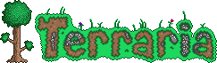
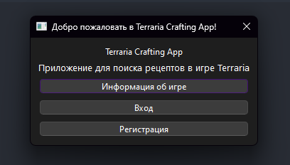
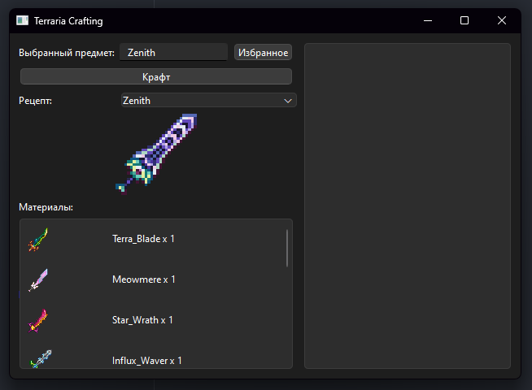
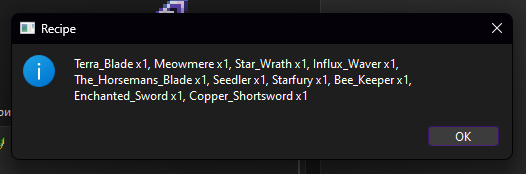
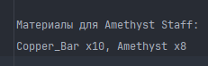
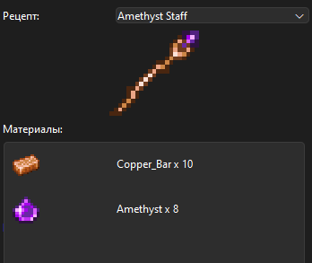
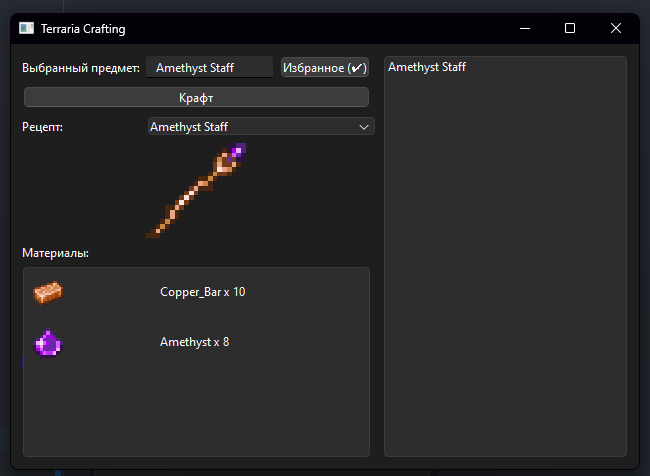

[]()

### **_Terraria_** - это страна приключений! Земля тайн! Земля, которую вы сами формируете, защищаете и наслаждаетесь ею. Ваши возможности в Terraria безграничны. Вы любитель экшн-игр с зудом в пальцах? Мастер-строитель? Коллекционер? Исследователь? Здесь найдется что-то для каждого.
___
## Terraria crafting App
### Зачем же нужно моё Qt приложение?
В самой игре бесчисленное множество крафтов, и запомнить их все весьма проблематично.
На это потребуется ни одна сотня часов. Поэтому я решил облегчить участь новых игроков,
и тех, кто просто подзабыл крафт того или иного предмета во время игры. Ведь каждый раз открывать Вики 
или бежать до гида не очень то приятно.
### В чём заключается основной функционал?
После открытия приложения вас встретит вступительное окно, где у вас есть три кнопки одна из которых, это информация об игре, 
а две другие, это регистрация и авторизация пользователя для хранения ваших избранных рецептов.

[]()
___
После регистрации вас встречает основное окно приложения



В выпадающем списке **Рецепт** вы можете выбрать предмет, крафт которого хотите посмотреть. 
___
Крафт выбранного предмета можно вывести на экран в виде списка 
и сохранить его в txt файл по нажатию на кнопку **Крафт**.



### recipes.txt:



А так же крафт отображается в основном окне снизу от выбранного предмета.


___
Самые популярные рецепты вы можете добавить в избранное нажав на кнопку **Избранное**.
После нажатия предмет будет отображаться в списке справа от основного интерфейса. 
Предметы в этом списке тоже можно выбирать, просто кликнув на них.



___

Список рецептов можно пополнить, просто добавив новые рецепты в список **recipes_no**, в файле **insert_recipes.py**.
```python
recipes_no = {
    "Wooden Sword": [["Wood x10"], "Image/item/Wooden_Sword.png"],
    "Copper Shortsword": [["Copper_Bar x5"], "Image/item/Copper_Shortsword.png"],
    "Iron Shortsword": [["Iron_Bar x6"], "Image/item/Iron_Shortsword.png"],
    "Silver Shortsword": [["Silver_Bar x6"], "Image/item/Silver_Shortsword.png"],
    "Gold Shortsword": [["Gold_Bar x6"], "Image/item/Gold_Shortsword.png"],
    "Copper Axe": [["Copper_Bar x6", "Wood x3"], "Image/item/Copper_Axe.png"],
    "Iron Axe": [["Iron_Bar x8", "Wood x3"], "Image/item/Iron_Axe.png"],
    "Silver Axe": [["Silver_Bar x8", "Wood x3"], "Image/item/Silver_Axe.png"],
    "Gold Axe": [["Gold_Bar x8", "Wood x3"], "Image/item/Gold_Axe.png"],
    "Copper Pickaxe": [["Copper_Bar x8", "Wood x4"], "Image/item/Copper_Pickaxe.png"],
    "Iron Pickaxe": [["Iron_Bar x8", "Wood x4"], "Image/item/Iron_Pickaxe.png"],
    "Silver Pickaxe": [["Silver_Bar x8", "Wood x4"], "Image/item/Silver_Pickaxe.png"],
    "Gold Pickaxe": [["Gold_Bar x8", "Wood x4"], "Image/item/Gold_Pickaxe.png"],
    "Amethyst Staff": [["Copper_Bar x10", "Amethyst x8", ], "Image/item/Amethyst_Staff.png"],
    "Zenith": [
        ["Terra_Blade x1", "Meowmere x1", "Star_Wrath x1", "Influx_Waver x1", "The_Horsemans_Blade x1", "Seedler x1",
         "Starfury x1", "Bee_Keeper x1", "Enchanted_Sword x1", "Copper_Shortsword x1"], "Image/item/Zenith.png"],
    "Terra Blade": [["Broken_Hero_Sword x1", "True_Excalibur x1", "True_Nights_Edge x1", ],
                    "Image/item/Terra_Blade.png"],
}
```
___
## Основные Технологии
Основной код программы **python**.
Для создания веб интерфейса использовалась библиотека **PyQt6**, для работы с базами данных **sqlite3**.

___
# Удачного пользования!
# 